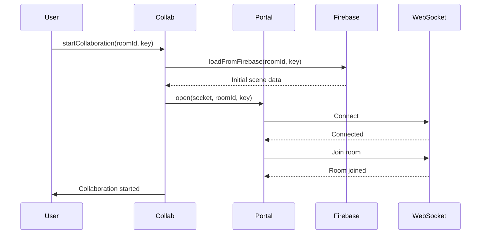

## Overview

Excalidraw's collaboration system enables multiple users to work on the same drawing in real-time. It handles state synchronization, conflict resolution, user presence, and file sharing through a WebSocket-based architecture with end-to-end encryption.

## Architecture

The collaboration system consists of several key components:

<Tabs>
  <Tab title="Collab Class">
    The main orchestrator for collaboration features:

    ```typescript excalidraw-app/collab/Collab.tsx
    class Collab extends PureComponent<CollabProps, CollabState> {
      portal: Portal;                    // WebSocket connection manager
      fileManager: FileManager;          // File upload/download handler
      excalidrawAPI: ExcalidrawImperativeAPI;
      collaborators: Map<SocketId, Collaborator>;
      
      startCollaboration(roomId: string, roomKey: string): Promise<void>;
      stopCollaboration(): void;
      syncElements(elements: readonly ExcalidrawElement[]): void;
      onPointerUpdate(payload: PointerUpdate): void;
    }
    ```
  </Tab>

  <Tab title="Portal">
    Manages WebSocket connections and message routing:

    ```typescript excalidraw-app/collab/Portal.tsx
    class Portal {
      socket: WebSocket | null;
      roomId: string | null;
      roomKey: string | null;
      
      open(socket: WebSocket, id: string, key: string): void;
      close(): void;
      broadcastElements(elements: ReconciledExcalidrawElement[]): void;
      broadcastMouseLocation(payload: PointerUpdate): void;
    }
    ```
  </Tab>

  <Tab title="Collaborator Type">
    Represents a remote user in the session:

    ```typescript packages/excalidraw/types.ts
    type Collaborator = Readonly<{
      pointer?: CollaboratorPointer;
      button?: "up" | "down";
      selectedElementIds?: AppState["selectedElementIds"];
      username?: string | null;
      userState?: UserIdleState;  // "active" | "away" | "idle"
      color?: { background: string; stroke: string };
      avatarUrl?: string;
      id?: string;
      socketId?: SocketId;
      isCurrentUser?: boolean;
      isInCall?: boolean;
      isSpeaking?: boolean;
      isMuted?: boolean;
    }>;
    ```
  </Tab>
</Tabs>

## Collaboration Lifecycle

### 1. Starting Collaboration

```typescript
import { CollabAPI } from "excalidraw-app/collab";

const collabAPI = useAtomValue(collabAPIAtom);

// Generate or parse room link
const roomLinkData = await generateCollaborationLinkData();
const { roomId, roomKey } = roomLinkData;

// Start collaboration session
await collabAPI.startCollaboration(roomId, roomKey);
```

<Accordion title="Room Link Format">
  Collaboration rooms use a specially formatted URL:

  ```
  https://excalidraw.com/#room=ROOM_ID,ENCRYPTION_KEY
  ```

  - **roomId**: Unique identifier for the collaboration session
  - **roomKey**: Encryption key for end-to-end encryption
  - Both are base64-encoded strings

  The key is only shared via the URL fragment (never sent to server).
</Accordion>

### 2. Connection Flow



### 3. Stopping Collaboration

```typescript
collabAPI.stopCollaboration();
// Closes WebSocket connection
// Clears collaborator state
// Stops file manager
```

## State Synchronization

### Element Synchronization

Elements are synchronized through a reconciliation process:

```typescript excalidraw-app/collab/Collab.tsx
// When local elements change
const syncableElements = getSyncableElements(elements);
collabAPI.syncElements(syncableElements);

// Internally:
- Filters out local-only elements
- Applies encryption
- Broadcasts to other users via WebSocket
- Saves to Firebase for persistence
```

<Tabs>
  <Tab title="Reconciliation">
    When receiving remote changes, elements are reconciled using version tracking:

    ```typescript
    import { reconcileElements } from "@excalidraw/excalidraw";

    const reconciledElements = reconcileElements(
      localElements,
      remoteElements,
      localAppState
    );
    ```

    Reconciliation logic:
    1. Compare element versions
    2. Keep higher version number
    3. For same version, compare `versionNonce`
    4. Preserve local selection state
    5. Merge deleted elements appropriately
  </Tab>

  <Tab title="Conflict Resolution">
    Conflicts are resolved using last-write-wins with version tracking:

    ```typescript
    // Element has:
    {
      version: 5,           // Incremented on each change
      versionNonce: 482736, // Random, regenerated on change
      updated: 1708372800   // Epoch timestamp
    }
    ```

    Resolution rules:
    - Higher `version` wins
    - If versions equal, higher `versionNonce` wins
    - `updated` timestamp used for tie-breaking
  </Tab>

  <Tab title="Syncable Elements">
    Not all elements are synced:

    ```typescript
    function getSyncableElements(elements: readonly ExcalidrawElement[]) {
      return elements.filter(element => {
        // Exclude selection elements
        if (element.type === "selection") return false;
        
        // Exclude temporary elements
        if (isTemporaryElement(element)) return false;
        
        return true;
      });
    }
    ```
  </Tab>
</Tabs>

### Broadcast Throttling

To optimize network usage, broadcasts are throttled:

```typescript
// Element updates throttled to prevent flooding
const SYNC_FULL_SCENE_INTERVAL_MS = 20000; // Full sync every 20s
const CURSOR_SYNC_TIMEOUT = 33; // Cursor updates ~30fps
```

## User Presence

### Pointer Tracking

```typescript packages/excalidraw/types.ts
type CollaboratorPointer = {
  x: number;
  y: number;
  tool: "pointer" | "laser";
  renderCursor?: boolean;  // Whether to show cursor + username
  laserColor?: string;     // Custom color for laser pointer
};

// Broadcasting pointer updates
collabAPI.onPointerUpdate({
  pointer: { x: 100, y: 200, tool: "pointer" },
  button: "down",
  pointersMap: gesturePointers,
});
```

<Note>
  Pointer updates are throttled to ~30fps to balance responsiveness with network efficiency.
</Note>

### User State Tracking

```typescript
type UserIdleState = "active" | "away" | "idle";

// User states based on inactivity:
- "active": User recently interacted (< 5s ago)
- "idle": No interaction for 5-60s
- "away": No interaction for > 60s

// Constants:
const ACTIVE_THRESHOLD = 5000;   // 5 seconds
const IDLE_THRESHOLD = 60000;    // 60 seconds
```

### Collaborative Cursors

Remote cursors are rendered on the interactive canvas:

```typescript
interface InteractiveCanvasRenderConfig {
  remotePointerViewportCoords: Map<SocketId, { x: number; y: number }>;
  remotePointerUserStates: Map<SocketId, UserIdleState>;
  remotePointerUsernames: Map<SocketId, string>;
  remotePointerButton: Map<SocketId, string | undefined>;
}
```

## Following Users

Users can follow each other's viewports:

```typescript packages/excalidraw/types.ts
type UserToFollow = {
  socketId: SocketId;
  username: string;
};

interface AppState {
  userToFollow: UserToFollow | null;  // Who you're following
  followedBy: Set<SocketId>;          // Who's following you
}

// Start following a user
excalidrawAPI.updateScene({
  appState: {
    userToFollow: { socketId: "socket123", username: "Alice" },
  },
});
```

<Accordion title="Follow Mode Behavior">
  When following a user:
  - Your viewport automatically scrolls to match theirs
  - Your zoom level adjusts to match theirs
  - Element selections are highlighted
  - Following can be broken by manual pan/zoom

  ```typescript
  // Callback when follow state changes
  onUserFollow?: (payload: OnUserFollowedPayload) => void;

  type OnUserFollowedPayload = {
    userToFollow: UserToFollow;
    action: "FOLLOW" | "UNFOLLOW";
  };
  ```
</Accordion>

## File Sharing

Collaboration includes file synchronization for images:

```typescript
class FileManager {
  async saveFiles({ addedFiles }): Promise<SaveFilesResult> {
    // Encrypt files with room key
    const encryptedFiles = await encodeFilesForUpload({
      files: addedFiles,
      encryptionKey: roomKey,
      maxBytes: FILE_UPLOAD_MAX_BYTES,  // 50MB limit
    });
    
    // Upload to Firebase Storage
    const result = await saveFilesToFirebase({
      prefix: `files/rooms/${roomId}`,
      files: encryptedFiles,
    });
    
    return result;
  }
  
  async getFiles(fileIds: FileId[]): Promise<BinaryFileData[]> {
    // Download and decrypt from Firebase
    return loadFilesFromFirebase(
      `files/rooms/${roomId}`,
      roomKey,
      fileIds
    );
  }
}
```

<Warning>
  File size is limited to 50MB per file. Larger files are rejected during upload.
</Warning>

## Encryption

All collaboration data uses end-to-end encryption:

```typescript
import { encryptData, decryptData } from "@excalidraw/excalidraw/data/encryption";

// Encrypting scene data
const encrypted = await encryptData(roomKey, {
  elements: syncableElements,
  files: filesToSync,
});

// Decrypting received data
const decrypted = await decryptData(roomKey, encryptedData);
```

<Accordion title="Encryption Implementation">
  - Uses AES-GCM encryption
  - Room key is generated as a secure random string
  - Key is never sent to the server (stays in URL fragment)
  - Each message has unique IV (initialization vector)
  - Authentication tags prevent tampering
</Accordion>

## WebSocket Protocol

The collaboration server uses Socket.IO with custom event types:

```typescript excalidraw-app/app_constants.ts
const WS_EVENTS = {
  SERVER_VOLATILE: "server-volatile-broadcast",
  SERVER: "server-broadcast",
};

const WS_SUBTYPES = {
  INIT: "INIT",
  UPDATE: "UPDATE",
  MOUSE_LOCATION: "MOUSE_LOCATION",
  USER_FOLLOW_CHANGE: "USER_FOLLOW_CHANGE",
};
```

<Tabs>
  <Tab title="Message Types">
    **SERVER_VOLATILE**
    - Pointer positions
    - Transient state updates
    - Not persisted if user disconnected

    **SERVER**
    - Element updates
    - Selection changes
    - File uploads
    - Persisted and replayed on reconnection
  </Tab>

  <Tab title="Message Flow">
    ```typescript
    // Sending elements
    socket.emit("server-broadcast", {
      type: "UPDATE",
      payload: {
        elements: encryptedElements,
        files: encryptedFiles,
      },
    });

    // Receiving elements
    socket.on("server-broadcast", async (data) => {
      if (data.type === "UPDATE") {
        const { elements, files } = await decryptData(roomKey, data.payload);
        reconcileAndUpdate(elements);
      }
    });
    ```
  </Tab>
</Tabs>

## Collaborative Features

### Remote Selection Highlights

```typescript
interface InteractiveCanvasRenderConfig {
  remoteSelectedElementIds: Map<ExcalidrawElement["id"], SocketId[]>;
  selectionColor: string;
}

// Remote users' selections are highlighted with their assigned color
```

### Collaborative Locking

```typescript packages/excalidraw/types.ts
interface AppState {
  // Multi-element lock groups
  lockedMultiSelections: { [groupId: string]: true };
  // Currently active locked element showing unlock popup  
  activeLockedId: string | null;
}
```

### Scene Versioning

```typescript
import { getSceneVersion } from "@excalidraw/element";

// Track scene changes for synchronization
const version = getSceneVersion(elements);
// Sum of all element versions (simple but effective)

const lastBroadcastedVersion = 1234;
if (version !== lastBroadcastedVersion) {
  // Scene changed, broadcast update
  syncElements(elements);
}
```

<Note>
  `getSceneVersion` is deprecated. Use `hashElementsVersion` for better collision resistance in large scenes.
</Note>

## Error Handling

```typescript excalidraw-app/collab/CollabError.tsx
// Global error indicator
const collabErrorIndicatorAtom = atom<{
  message: string;
  hasError: boolean;
} | null>(null);

// Set collaboration error
collabAPI.setCollabError({
  message: "Connection lost. Attempting to reconnect...",
  hasError: true,
});

// Clear error
collabAPI.setCollabError(null);
```

### Connection States

```typescript
const isCollaboratingAtom = atom(false);  // In active session
const isOfflineAtom = atom(false);        // Network disconnected

// React to connection state
const isCollaborating = useAtomValue(isCollaboratingAtom);
const isOffline = useAtomValue(isOfflineAtom);

if (isOffline) {
  // Show offline indicator
  // Queue changes for when connection returns
}
```

## Integration Example

```typescript
import { Excalidraw } from "@excalidraw/excalidraw";
import { Collab } from "excalidraw-app/collab";

function CollaborativeExcalidraw() {
  const [excalidrawAPI, setExcalidrawAPI] = useState<ExcalidrawImperativeAPI | null>(null);
  const [collabAPI, setCollabAPI] = useState<CollabAPI | null>(null);

  return (
    <>
      <Excalidraw
        excalidrawAPI={(api) => setExcalidrawAPI(api)}
        isCollaborating={true}
        onChange={(elements, appState, files) => {
          // Sync changes to other users
          collabAPI?.syncElements(elements);
        }}
        onPointerUpdate={(payload) => {
          // Broadcast pointer position
          collabAPI?.onPointerUpdate(payload);
        }}
      />
      
      {excalidrawAPI && (
        <Collab
          excalidrawAPI={excalidrawAPI}
          ref={(collab) => setCollabAPI(collab)}
        />
      )}
    </>
  );
}
```

## Best Practices

<Accordion title="Network Optimization">
  - Throttle broadcasts to prevent network flooding
  - Use volatile events for transient state (cursors)
  - Batch element updates when possible
  - Compress large payloads before encryption
  - Implement exponential backoff for reconnection
</Accordion>

<Accordion title="Conflict Resolution">
  - Trust version numbers for element reconciliation
  - Never decrement version numbers
  - Use versionNonce for same-version conflicts
  - Preserve user intent during reconciliation
  - Handle deleted elements gracefully
</Accordion>

<Accordion title="Security">
  - Never send encryption keys to server
  - Validate all incoming data before decryption
  - Sanitize user-provided content (usernames, etc.)
  - Implement rate limiting for broadcasts
  - Handle malformed messages gracefully
</Accordion>

<Accordion title="User Experience">
  - Show clear collaboration status indicators
  - Display collaborator avatars and names
  - Provide feedback for connection issues
  - Allow easy copying of room links
  - Implement graceful degradation when offline
</Accordion>

## Performance Considerations

<Tabs>
  <Tab title="Large Scenes">
    For scenes with many elements:
    - Use incremental updates instead of full syncs
    - Implement spatial indexing for collision detection
    - Throttle reconciliation frequency
    - Consider delta compression
  </Tab>

  <Tab title="Many Users">
    For sessions with many collaborators:
    - Limit rendered cursor count
    - Implement cursor culling for off-screen users
    - Batch presence updates
    - Use separate channels for cursors vs. elements
  </Tab>

  <Tab title="Mobile">
    Mobile-specific optimizations:
    - Reduce cursor broadcast frequency
    - Lower file size limits
    - Implement adaptive quality
    - Handle network transitions gracefully
  </Tab>
</Tabs>

## Related Concepts

- [Elements](/concepts/elements) - Element versioning and reconciliation
- [Scene](/concepts/scene) - Scene state management
- [App State](/concepts/app-state) - Collaboration-related state properties